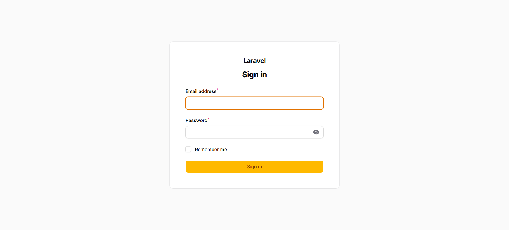
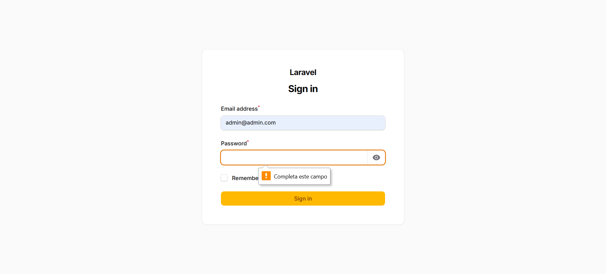
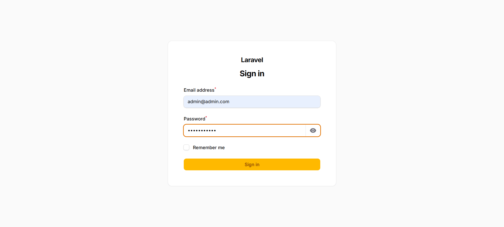
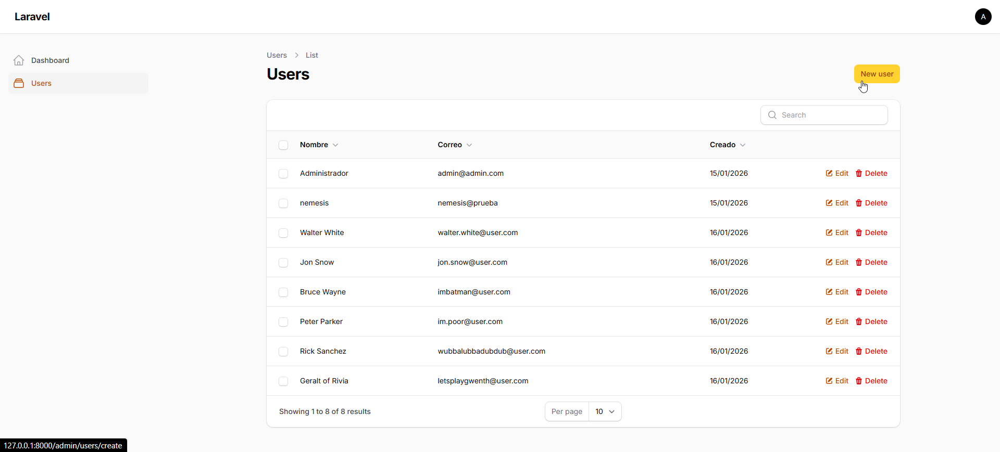
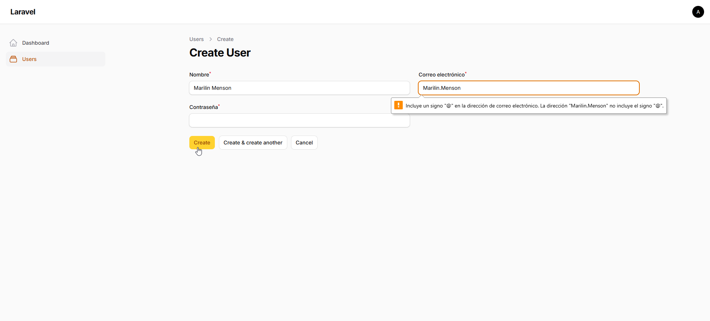
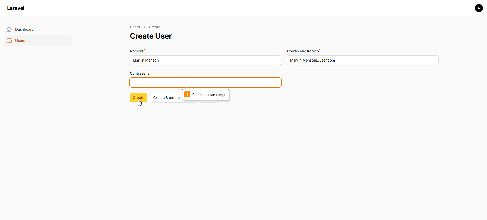
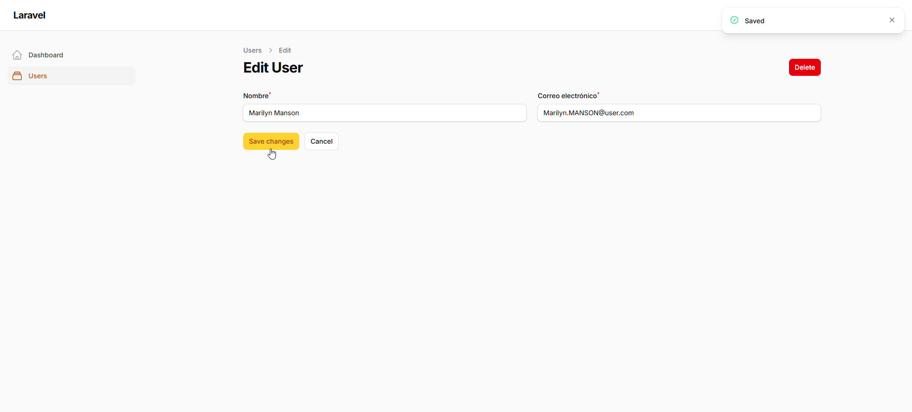
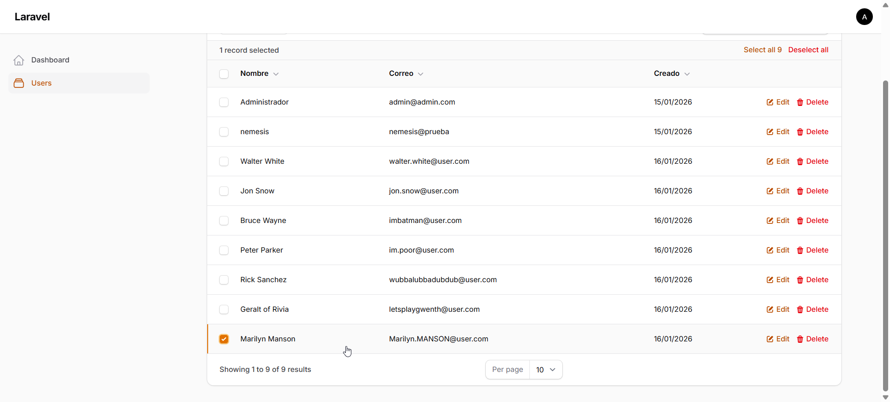

Laravel – CRUD de Usuarios

Prueba técnica con Laravel, MySQL y Filament, que implementa autenticación y un CRUD de usuarios mediante un panel administrativo.

=== Tecnologías utilizadas ===

* PHP 8.5.1
* Laravel 12
* MySQL
* Filament (Panel administrativo)
* Composer
* Git / GitHub

Requisitos del sistema

* PHP 8.1+
* Composer
* MySQL

---

=== Instalación del proyecto ===

Abrir la terminal del sistema y clonar el repositorio

git clone https://github.com/Burnestein/prueba-laravel.git
cd laravel-filament

2. Instalar dependencias

composer install

3. Configurar variables de entorno

3.1 Copiar el archivo de ejemplo:
cp .env.example .env

3.2 Editar el archivo .env y configurar la conexión a la base de datos:
(Requiere crear base de datos "pruebalaravel_db", los valores de usuario son los default por MySQL)
DB_CONNECTION=mysql
DB_HOST=127.0.0.1
DB_PORT=3306
DB_DATABASE=pruebalaravel_db
DB_USERNAME=root
DB_PASSWORD=

3.3 Generar la key de la aplicación
php artisan key:generate

---

### Base de datos ###

Ejecutar migracion:
(Crea la tabla users con los campos: id, name, email, password, created_at/updated_at)

php artisan migrate

2. Ejecutar seeder:
(Crea usuario administrador)

php artisan db:seed

---

Credenciales de acceso (Seeder)

Abrir panel administrativo:

1. Correr el servidor en la carpeta raíz del proyecto

php artisan serve

2. Abrir en el navegador:

http://127.0.0.1:8000/admin
Email: admin@admin.com
Password: password123

---

## 📸 Capturas del proyecto

### 🔐 Login

### 📊 Dashboard

### ➕ Crear usuario

por Nemesis Sierra
